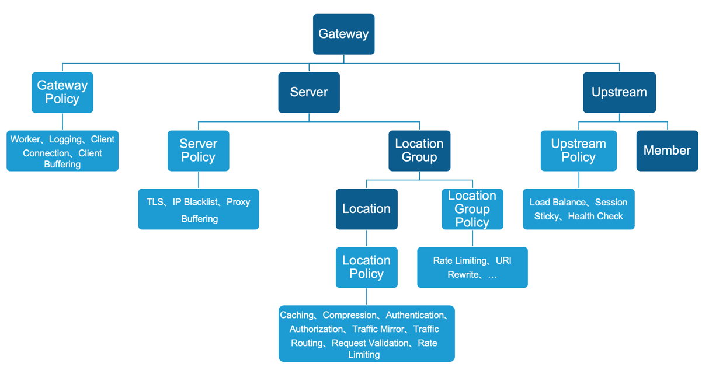

# 配置模型设计与自动化功能测试

NGINX的功能丰富且强大，但是对于API网关的场景我们只需要部分功能，且针对不同的API开发者或运维人员不需要掌握相对复杂的原生NGINX配置，
因此我们需要做一定的抽象化设计，简化配置的难度。

## 设计配置模型结构

采用领域驱动设计的思路，我们将对象分为实体、值对象两类：

实体（有唯一实体ID，且具备独立生命周期）：
* 网关（Gateway）
* 虚拟服务（Server）
* API组（LocationGroup）
* API（Location）
* 后端服务集群（Upstream）

值对象：
* 网关策略（GatewayPolicy）
* 虚拟服务策略（ServerPolicy）
* API组策略（LocationGroupPolicy）
* API策略（LocationPolicy）
* 后端服务集群策略（UpstreamPolicy）
* 后端服务实例（Member）
* ...

顶层结构关系：




etcd的Key结构设计：

* 网关（Gateway）：`/gateways/<gateway_id>`
* 虚拟服务（Server）：`/gateways/<gateway_id>/http/servers/<server_id>`
* API组（LocationGroup）：`/gateways/<gateway_id>/http/servers/<server_id>/groups/<group_id>`
* API（Location）：`/gateways/<gateway_id>/http/servers/<server_id>/groups/<group_id>/locations/<location_id>`
* 后端服务集群（Upstream）：`/gateways/<gateway_id>/http/servers/<server_id>/upstreams/<upstream_id>`


模型源码可 [在此](https://github.com/yijiuping/nginx-as-apigateway/tree/main/config-model/src/main/java/com/nginx/gateway/model) 访问。

Gateway配置实例：

```
{
  "id": "6369a89cf67ffcb560daa2a8",
  "name": "gateway_warehouse",
  "policy": {
    "processes": {
      "worker_connections": "65535",
      "worker_cpu_affinity": "auto",
      "worker_processes": "auto",
      "worker_rlimit_nofile": 655350,
      "server_tokens": "off"
    },
    "management": {
      "mgmt_port": 8859,
      "mgmt_metrics": "on",
      "mgmt_health": "on",
      "mgmt_allow_cidrs": [
        "all"
      ]
    },
    "logging": {
      "access_log": {
        "access_log_format": "escape\u003djson \u0027{\"datetime\":\"$time_iso8601\",\u0027\n                           \u0027\"remote_addr\":\"$remote_addr\",\u0027\n                           \u0027\"request\":\"$request\",\u0027\n                           \u0027\"http_x_forwarded_for\":\"$http_x_forwarded_for\",\u0027\n                           \u0027\"http_referer\":\"$http_referer\",\u0027\n                           \u0027\"request_length\":\"$request_length\",\u0027\n                           \u0027\"http_host\":\"$http_host\",\u0027\n                           \u0027\"status\":\"$status\",\u0027\n                           \u0027\"body_bytes_sent\":\"$body_bytes_sent\",\u0027\n                           \u0027\"request_time\":\"$request_time\",\u0027\n                           \u0027\"upstream_addr\":\"$upstream_addr\",\u0027\n                           \u0027\"upstream_status\":\"$upstream_status\",\u0027\n                           \u0027\"upstream_http_content_type\":\"$upstream_http_content_type\",\u0027\n                           \u0027\"upstream_response_time\":\"$upstream_response_time\",\u0027\n                           \u0027\"server_port\":\"$server_port\"\u0027\n                           \u0027}\u0027",
        "access_log_protocol": "FILE",
        "access_log_file_path": "/var/log/nginx/access.log"
      },
      "error_log": {
        "error_log_level": "debug",
        "error_log_protocol": "FILE",
        "error_log_file_path": "/var/log/nginx/error.log"
      }
    },
    "client_conn": {
      "keepalive_requests": 1000,
      "keepalive_timeout": "75s",
      "keepalive_time": "1h",
      "client_header_timeout": 60,
      "client_body_timeout": 60,
      "reset_timedout_connection": "on",
      "send_timeout": 60
    },
    "status_codes": {
      "statuses": [
        {
          "code": 400,
          "message": "{\"status\":400,\"message\":\"Bad request\"}\\n"
        },
        {
          "code": 401,
          "message": "{\"status\":401,\"message\":\"Unauthorized\"}\\n"
        },
        {
          "code": 403,
          "message": "{\"status\":403,\"message\":\"Forbidden\"}\\n"
        },
        {
          "code": 404,
          "message": "{\"status\":404,\"message\":\"Resource not found\"}\\n"
        },
        {
          "code": 405,
          "message": "{\"status\":405,\"message\":\"Method not allowed\"}\\n"
        },
        {
          "code": 408,
          "message": "{\"status\":408,\"message\":\"Request timeout\"}\\n"
        },
        {
          "code": 413,
          "message": "{\"status\":413,\"message\":\"Payload too large\"}\\n"
        },
        {
          "code": 414,
          "message": "{\"status\":414,\"message\":\"Request URI too large\"}\\n"
        },
        {
          "code": 415,
          "message": "{\"status\":415,\"message\":\"Unsupported media type\"}\\n"
        },
        {
          "code": 426,
          "message": "{\"status\":426,\"message\":\"HTTP request was sent to HTTPS port\"}\\n"
        },
        {
          "code": 429,
          "message": "{\"status\":429,\"message\":\"API rate limit exceeded\"}\\n"
        },
        {
          "code": 429,
          "message": "{\"status\":429,\"message\":\"API rate limit exceeded\"}\\n"
        },
        {
          "code": 495,
          "message": "{\"status\":495,\"message\":\"Client certificate authentication error\"}\\n"
        },
        {
          "code": 496,
          "message": "{\"status\":496,\"message\":\"Client certificate not presented\"}\\n"
        },
        {
          "code": 497,
          "message": "{\"status\":497,\"message\":\"HTTP request was sent to mutual TLS port\"}\\n"
        },
        {
          "code": 500,
          "message": "{\"status\":500,\"message\":\"Server error\"}\\n"
        },
        {
          "code": 501,
          "message": "{\"status\":501,\"message\":\"Not implemented\"}\\n"
        },
        {
          "code": 502,
          "message": "{\"status\":502,\"message\":\"Bad gateway\"}\\n"
        }
      ]
    },
    "credentials": {
      "users": [
        {
          "username": "admin",
          "password": "$apr1$aP2Dgjk3$QHaaXeHa/T8lYtNBz8z4D0"
        },
        {
          "username": "rob",
          "password": "$apr1$aP2Dgjk3$QHaaXeHa/T8lYtNBz8z4D0"
        }
      ]
    },
    "api_key_auth": {
      "input_type": "HEADER",
      "api_key_name": "x-api-key",
      "default_key": "",
      "api_keys": [
        {
          "key": "client_one",
          "secret": "7B5zIqmRGXmrJTFmKa99vcit"
        },
        {
          "key": "client_two",
          "secret": "QzVV6y1EmQFbbxOfRCwyJs35"
        },
        {
          "key": "client_six",
          "secret": "mGcjH8Fv6U9y3BVF9H3Ypb9T"
        }
      ]
    }
  }
}

```

Server配置实例：

```
{
  "id": "6369a89cf67ffcb560daa2a9",
  "gateway_id": "6369a89cf67ffcb560daa2a8",
  "name": "server_warehouse",
  "port": 80,
  "policy": {
    "client_conn": {
      "keepalive_requests": 1000,
      "keepalive_timeout": "75s",
      "keepalive_time": "1h",
      "client_header_timeout": 60,
      "client_body_timeout": 60,
      "reset_timedout_connection": "on",
      "send_timeout": 60
    },
    "ssl_offload": {
      "https_port": 443,
      "http2": "off",
      "certificate": "/oss/ssl/example.com.crt",
      "certificate_key": "/oss/ssl/example.com.key",
      "ssl_session_cache": "shared:SSL:10m",
      "ssl_session_timeout": "5m",
      "ssl_ciphers": "HIGH:!aNULL:!MD5",
      "ssl_protocols": "TLSv1.2 TLSv1.3"
    },
    "redirect": {
      "ssl_redirect": true
    },
    "client_buffer": {
      "proxy_request_buffering": "on",
      "client_header_buffer_size": "1k",
      "large_client_header_buffers": "4 8k",
      "client_body_buffer_size": "16k"
    },
    "proxy_buffer": {
      "proxy_buffering": "on",
      "proxy_buffer_size": "8k",
      "proxy_buffers": "8 8k",
      "proxy_busy_buffers_size": "16k",
      "proxy_temp_file_write_size": "16k",
      "proxy_max_temp_file_size": "1024m"
    }
  }
}

```

LocationGroup配置实例：

```
{
  "id": "6369a89cf67ffcb560daa2aa",
  "gateway_id": "6369a89cf67ffcb560daa2a8",
  "server_id": "6369a89cf67ffcb560daa2a9",
  "uri": "/api/warehouse/",
  "policy": {
    "logging": {
      "access_log": {
        "access_log_format": "escape\u003djson \u0027{\"datetime\":\"$time_iso8601\",\u0027\n                           \u0027\"remote_addr\":\"$remote_addr\",\u0027\n                           \u0027\"request\":\"$request\",\u0027\n                           \u0027\"http_x_forwarded_for\":\"$http_x_forwarded_for\",\u0027\n                           \u0027\"http_referer\":\"$http_referer\",\u0027\n                           \u0027\"request_length\":\"$request_length\",\u0027\n                           \u0027\"http_host\":\"$http_host\",\u0027\n                           \u0027\"status\":\"$status\",\u0027\n                           \u0027\"body_bytes_sent\":\"$body_bytes_sent\",\u0027\n                           \u0027\"request_time\":\"$request_time\",\u0027\n                           \u0027\"upstream_addr\":\"$upstream_addr\",\u0027\n                           \u0027\"upstream_status\":\"$upstream_status\",\u0027\n                           \u0027\"upstream_http_content_type\":\"$upstream_http_content_type\",\u0027\n                           \u0027\"upstream_response_time\":\"$upstream_response_time\",\u0027\n                           \u0027\"server_port\":\"$server_port\"\u0027\n                           \u0027}\u0027",
        "access_log_protocol": "FILE",
        "access_log_file_path": "/var/log/nginx/access.log"
      },
      "error_log": {
        "error_log_level": "debug",
        "error_log_protocol": "FILE",
        "error_log_file_path": "/var/log/nginx/error.log"
      }
    },
    "uri_rewrite": {
      "uri_maps": [
        {
          "from": "^/api/warehouse/inventory/item/price",
          "to": "/api/warehouse/pricing"
        }
      ]
    },
    "api_key_auth": "_validate_apikey",
    "basic_auth": {
      "auth_basic": "Please input Username and Password",
      "auth_basic_user_file": "/etc/nginx/conf.d/credentials"
    },
    "request_valid": {
      "client_max_body_size": "16k"
    },
    "rate_limit": {
      "key": "$binary_remote_addr",
      "zone_name": "client_ip_10rs",
      "zone_size": "1m",
      "rate": "10r/s",
      "burst": 5,
      "nodelay": false,
      "delay_number": 0,
      "log_level": "error"
    }
  }
}

```

Location配置实例：

```
{
  "id": "6369a8a0f67ffcb560daa2ac",
  "gateway_id": "6369a89cf67ffcb560daa2a8",
  "server_id": "6369a89cf67ffcb560daa2a9",
  "group_id": "6369a89cf67ffcb560daa2aa",
  "uri": "/api/warehouse/inventory",
  "policy": {
    "request_valid": {
      "allow_methods": [
        "GET"
      ],
      "json_body_check": false,
      "client_max_body_size": "16k"
    },
    "rate_limit": {
      "key": "$binary_remote_addr",
      "zone_name": "client_ip_10rs",
      "zone_size": "1m",
      "rate": "10r/s",
      "burst": 5,
      "nodelay": false,
      "delay_number": 0
    },
    "traffic_mirror": {
      "mirror": "on",
      "mirror_location": "/api/warehouse/inventory_mirror",
      "mirror_request_body": "on",
      "mirror_upstream": "inventory_mirror"
    },
    "traffic_route": {
      "default_upstream": "inventory"
    },
    "web_socket": {
      "web_socket_switch": "off"
    },
    "proxy_caching": {
      "proxy_cache_switch": "off",
      "proxy_cache_key_zone": "api_cache",
      "proxy_cache_key_zone_size": "10m",
      "proxy_cache_max_size": "10g",
      "proxy_cache_duration": "60m",
      "proxy_cache_path": "/var/cache/nginx/proxy_cache levels\u003d1:2",
      "proxy_cache_revalidate": "on",
      "proxy_cache_min_uses": 3,
      "proxy_cache_use_stale": "error timeout updating http_500 http_502 http_503 http_504",
      "proxy_cache_background_update": "on",
      "proxy_cache_lock": "on",
      "proxy_cache_valid": "any 10m",
      "proxy_cache_key": "$scheme$proxy_host$request_uri"
    },
    "compression": {
      "gzip": "off",
      "gzip_min_length": "1k",
      "gzip_buffers": "16 64k",
      "gzip_http_version": "1.1",
      "gzip_comp_level": 4,
      "gzip_types": "text/plain application/x-javascript text/css application/xml application/json",
      "gzip_vary": "on",
      "gzip_disable": "msie6",
      "gzip_proxied": "any"
    }
  }
}

```

Upstream配置实例：

```
{
  "id": "6369a89ff67ffcb560daa2ab",
  "gateway_id": "6369a89cf67ffcb560daa2a8",
  "server_id": "6369a89cf67ffcb560daa2a9",
  "name": "inventory",
  "is_mirror": false,
  "is_canary": false,
  "members": [
    {
      "address": "192.168.51.7:8080",
      "weight": 1
    }
  ],
  "policy": {
    "load_balance": {
      "algorithm": "RANDOM",
      "hash_key": "$remote_addr"
    },
    "upstream_conn": {
      "keepalive": 32,
      "keepalive_requests": 1000,
      "keepalive_time": "1h",
      "keepalive_timeout": "60s",
      "fail_timeout": 5,
      "max_fails": 3,
      "max_conns": 0
    }
  }
}

```

## 开发配置模板

参考配置[模板设计](../config-templates/README.md)。

## 自动化功能测试

采用测试驱动的思想，先设计测试用例再做配置模板的开发。同时为了简化测试用例的维护，实现了简单的数据驱动测试功能，测试用例可复用于自动化集成测试。

测试用例按照"约定"的形式定义，结构如下：
<场景名称>
    |-configs: 场景的配置数据
    |   ｜- gateway_xxx.json: 网关实例配置，需要以`gateway_`为前缀
    |   ｜- server_xxx.json:  虚拟服务实例配置，需要以`server_`为前缀
    |   ｜- group_xxx.json:   API组实例配置，需要以`group_`为前缀
    |   ｜- location_xxx.json:API实例配置，需要以`location_`为前缀
    |   ｜- upstream_xxx.json:后端服务集群配置，需要以`upstream_`为前缀
    |- scenario.json：场景的配置文件，支持多测试用例，每个用例可定义"请求"及"响应"，基于预期的"响应"判断API网关返回结果是否与预期一致。

测试用例参考：
```
ip_blacklist
|-configs:
|   ｜- gateway_warehouse.json
|   ｜- server_warehouse.json
|   ｜- group_warehouse.json
|   ｜- location_inventory.json
|   ｜- upstream_inventory.json
|- scenario.json
```

scenario.json配置内容：
```
{
  "name": "ip_blacklist",
  "cases": [
    {
      "name": "case1",

      "request": {
        "scheme": "http",
        "port": "80",
        "method": "GET",
        "uri": "/api/warehouse/inventory"
      },
      "response": {
        "status": "405"
      }
    }
  ]
}

```

server_warehouse.json

```
{
  "id": "6369a89cf67ffcb560daa2a9",
  "gateway_id": "6369a89cf67ffcb560daa2a8",
  "name": "server_warehouse",
  "port": 80,
  "policy": {
    "ip_access_control":{
      "items": [
        {
          "type": "deny",
          "address": "192.168.51.1"
        }
      ]
    }
  }
}

```

通过参数的方式添加新的测试用例到Test类文件，如：

src/test/java/com/nginx/gateway/DataDrivenTest.java

``` java
public class DataDrivenTest {

    @ParameterizedTest
    @ValueSource(strings = {
            "generic/simple",
            "generic/client_conn",
            "auth/basic",
            "auth/apikey",
            "access_control/ip_blacklist",
            "access_control/ip_whitelist",
            "compression/location_gzip_on",
            "compression/group_gzip_on",
            "proxy_cache/location_cache_on",
            "conn_limit/limit_1",
            "load_balance/algorithm",
            "mgmt/enable_mgmt",
            "mgmt/disable_mgmt",
            "rate_limit/per_group",
            "rate_limit/per_location",
            "request_valid/per_group",
            "request_valid/per_location",
            "status_code/status_msg",
            "tls/ssl_offload",
            "traffic_mirror/mirror",
            "traffic_route/route_by_ratio",
            "traffic_route/route_by_arg",
            "traffic_route/route_by_header",
            "traffic_route/route_by_var",
            "traffic_route/route_by_cookie",
            "uri_rewrite/uri_exact",
    })
    public void testGateway(String test) throws Exception {
        ...
    }

```
